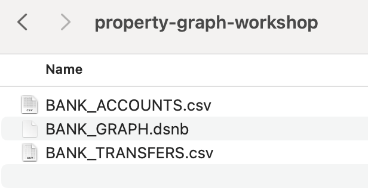
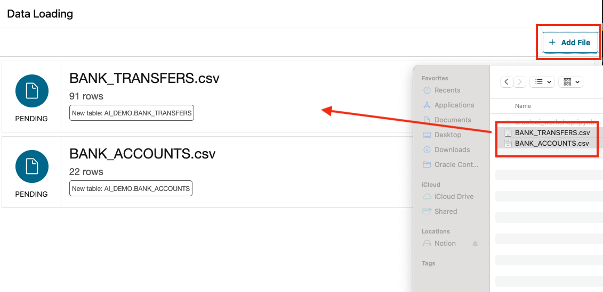
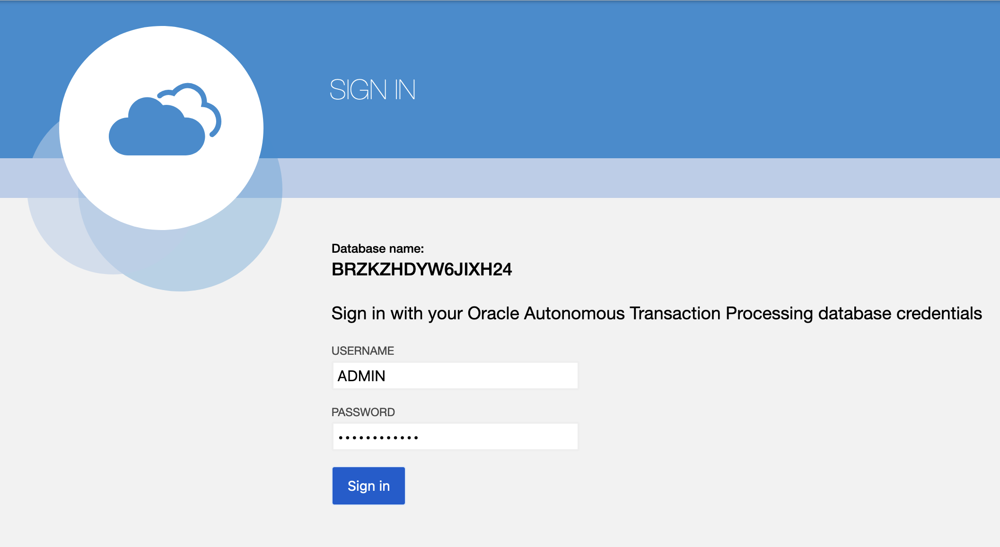

# Setup User

## Introduction

You will be creating an Operational Property Graph inside of Graph Studio, one of the applications that's available in 23ai Autonomous Database. 

In this lab you will query the newly created graph (that is, `bank_graph`) using SQL/PGQ, a new extension in SQL:2023.
​

**_Estimated Lab Time: 20 minutes_**

### Objectives

In this lab, you will:
* Open up Graph Studio
* Create an Operational Property Graph
* Use SQL/PGQ to define and query a property graph

### Prerequisites

This lab assumes you have:
* Access to an Oracle Autonomous Database 23ai
- The bank\_accounts and bank\_transfers tables exist.

<!-- <if type="livelabs">
Watch the video below for a quick walk-through of the lab. The lab instructions on the left might not match the workshop you are currently in, but the steps in the terminal on the right remain the same.
[Change password](videohub:1_x4hgmc2i)
</if> -->

## Task 1: Download setup materials

1. Click [this link] (https://objectstorage.ap-singapore-1.oraclecloud.com/n/hutchhk/b/AIWorkshop/o/property-graph-workshop.zip) to download the zip file with our property graph setup materials.

2. Unzip the files. You should see these files available. Most of these files we will not be using throughout the lab, but are available if you would like to see what commands we chose to create the schema with (CreateKeys.sql) or the data that populates the tables that we've created (BANK\_ACCOUNTS.csv and BANK\_TRANSFERS.csv).

    

3. Back to the SQL action console.

    

3. Import bank account and transfer example data into your database.

    
    
    
    
    
    
    
    
    

## Task 2: Create the Property Graph

1. Click graph studio.

    

2. Sign into Graph Studio. 

    Username: ADMIN

    Password: Listed underneath Terraform Values -> User Password (AIWorkshop123#).

    

3. Click on the Graph symbol on the left-hand side menu.

    

4. Click </> Query.

    

5. Use the following SQL statement to create a property graph called BANK\_GRAPH using the BANK\_ACCOUNTS table as the vertices and the BANK_TRANSFERS table as edges. Paste this into the text box:

    ```
    <copy>
    CREATE PROPERTY GRAPH BANK_GRAPH 
    VERTEX TABLES (
        BANK_ACCOUNTS
        KEY (ID)
        PROPERTIES (ID, Name, Balance, Email, Address, Zip, Phone_Number) 
    )
    EDGE TABLES (
        BANK_TRANSFERS 
        KEY (TXN_ID) 
        SOURCE KEY (src_acct_id) REFERENCES BANK_ACCOUNTS(ID)
        DESTINATION KEY (dst_acct_id) REFERENCES BANK_ACCOUNTS(ID)
        PROPERTIES (src_acct_id, dst_acct_id, amount)
    ) OPTIONS (PG_SQL);
    </copy>
    ```

    

6. Click Run. It should say Graph Successfully Created as a result at the bottom.

    

## Task 3: Prepare the graph environment

1. Click the notebook icon on the left hand menu.

    

2. Click DETACHED.

    

3. Click the start button.

    

4. You'll see a message saying that Graph Studio is being attached to an internal compute environment. The notebook will allow us to run PGQ queries against our bank schema, but first needs to spin up. It should take less than a minute.

    

5. Once it completed, it should look like this. You can see the DETACHED message in the upper right corner turn to say ATTACHED with a green light.

    

6. Load in memory the graph. Paste the following SQL statement into the text box:

    
    
    

7. You may now proceed to the next lab.

## Task 4 : Import the Notebook

1. Import Notebook
    
    

2. Follow the notebook to complete this lab.

## Learn More

* [Introducing Oracle Database 23ai Free – Developer Release](https://blogs.oracle.com/database/post/oracle-database-23c-free)
