# Setup User

## Introduction

You will be creating an Operational Property Graph inside of Graph Studio, one of the applications that's available in 23ai Autonomous Database. 

In this lab you will query the newly created graph (that is, `bank_graph`) using SQL/PGQ, a new extension in SQL:2023.
​

**_Estimated Lab Time: 20 minutes_**

### Objectives

In this lab, you will:
* Open up Graph Studio
* Create an Operational Property Graph
* Use SQL/PGQ to define and query a property graph

### Prerequisites

This lab assumes you have:
* Access to an Oracle Autonomous Database 23ai
- The bank\_accounts and bank\_transfers tables exist.

<!-- <if type="livelabs">
Watch the video below for a quick walk-through of the lab. The lab instructions on the left might not match the workshop you are currently in, but the steps in the terminal on the right remain the same.
[Change password](videohub:1_x4hgmc2i)
</if> -->

## Task 1: Download setup materials

1. Click [this link] (https://objectstorage.ap-singapore-1.oraclecloud.com/n/hutchhk/b/AIWorkshop/o/property-graph-workshop.zip) to download the zip file with our property graph setup materials.

2. Unzip the files. You should see these files available. Most of these files we will not be using throughout the lab, but are available if you would like to see what commands we chose to create the schema with (CreateKeys.sql) or the data that populates the tables that we've created (BANK\_ACCOUNTS.csv and BANK\_TRANSFERS.csv).

    

3. Import bank account and transfer example data into your database.

    
    
    
    
    
    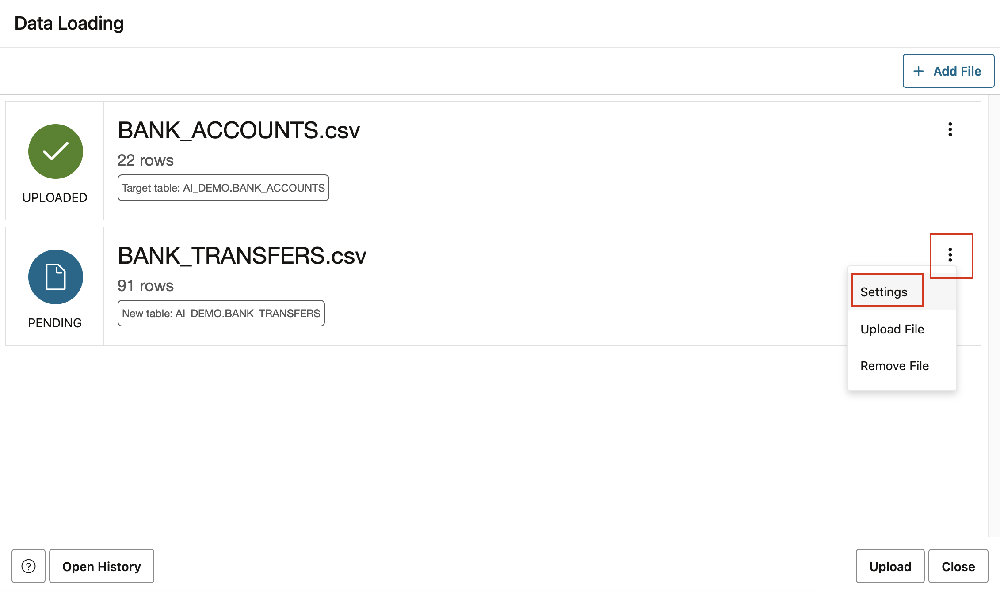
    
    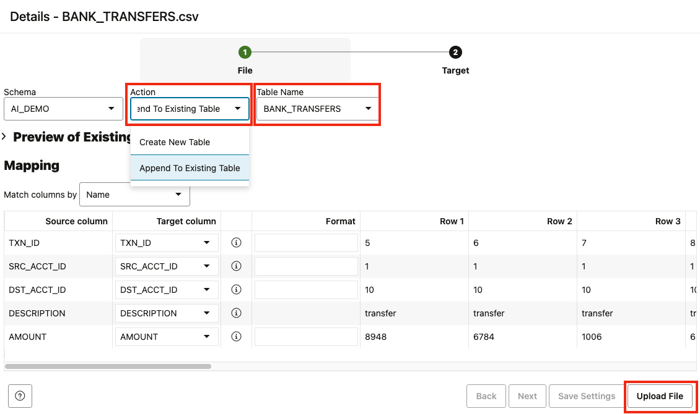
    

## Task 2: Create the Property Graph

1. Click graph studio.

    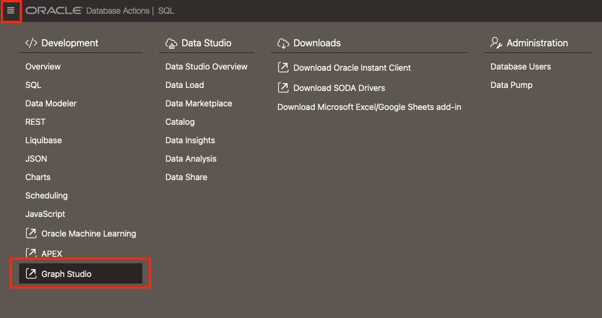

2. Sign into Graph Studio. 

    Username: ADMIN

    Password: Listed underneath Terraform Values -> User Password (ComeWel123##).

    

3. Click on the Graph symbol on the left-hand side menu.

    

4. Click </> Query.

    

5. Use the following SQL statement to create a property graph called BANK\_GRAPH using the BANK\_ACCOUNTS table as the vertices and the BANK_TRANSFERS table as edges. Paste this into the text box:

    ```
    <copy>
    CREATE PROPERTY GRAPH BANK_GRAPH 
    VERTEX TABLES (
        BANK_ACCOUNTS
        KEY (ID)
        PROPERTIES (ID, Name, Balance, Email, Address, Zip, Phone_Number) 
    )
    EDGE TABLES (
        BANK_TRANSFERS 
        KEY (TXN_ID) 
        SOURCE KEY (src_acct_id) REFERENCES BANK_ACCOUNTS(ID)
        DESTINATION KEY (dst_acct_id) REFERENCES BANK_ACCOUNTS(ID)
        PROPERTIES (src_acct_id, dst_acct_id, amount)
    ) OPTIONS (PG_SQL);
    </copy>
    ```

    

6. Click Run. It should say Graph Successfully Created as a result at the bottom.

    

## Task 3: Spin up the Notebook

1. Click the notebook icon on the left hand menu.

    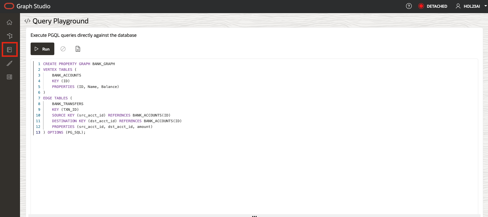

2. Click Create.

    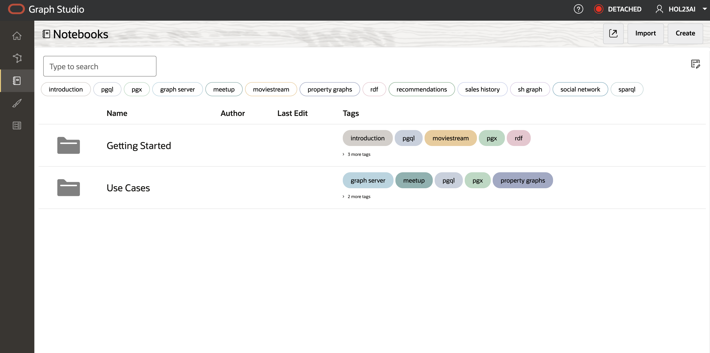

3. You can name the notebook **BANK_GRAPH**. The description will be **Notebook for Operational Property Graphs LiveLab**. You can leave the tags empty.

    

4. You'll see a message saying that Graph Studio is being attached to an internal compute environment. The notebook will allow us to run PGQ queries against our bank schema, but first needs to spin up. It should take less than a minute.

    

5. Once it finishes, it should look like this. You can see the DETACHED message in the upper right corner turn to say ATTACHED with a green light.

    

6. You may now proceed to the next lab.

## Task 4 : Query metadata of bank_graph
1. On the same page within your notebook, hover your mouse over the center bottom of the text box that appears and click the Add SQL Paragraph button. 

    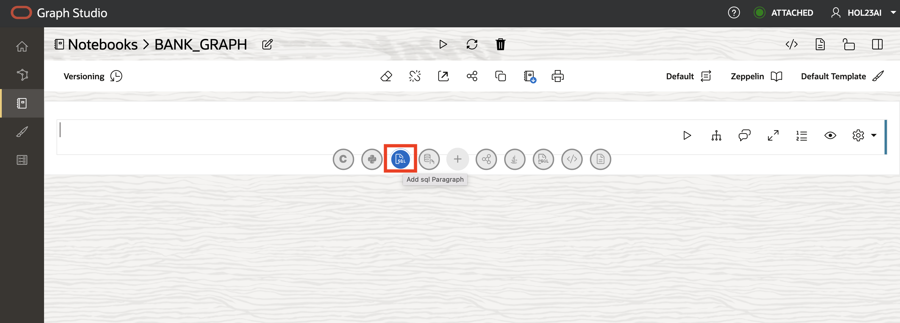

2. Click the expand button in the upper right corner.

    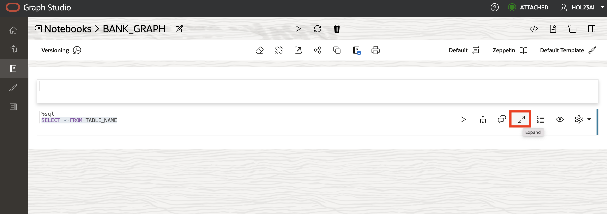

3. In our database, we can check the metadata views to list the graph we made, its elements, labels, and properties. First we will be listing the graphs, but there is only one property graph we have created, so BANK\_GRAPH will be the only entry.

    After the %sql in the new text box, paste the following query.

    ```
    <copy>
    SELECT * FROM user_property_graphs;
    </copy>
    ```

    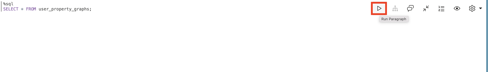

4. Click the play button on the right side to execute the query.

    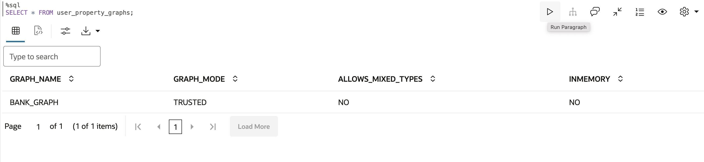
​
5. This query shows the DDL for the BANK_GRAPH graph. 

    **NOTE:** Ensure that the %sql is in the beginning of every query.

    ```
    <copy>
    SELECT dbms_metadata.get_ddl('PROPERTY_GRAPH', 'BANK_GRAPH') from dual;
    </copy>
    ```

    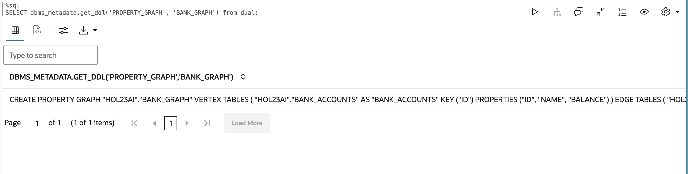

6. Here you can look at the elements of the BANK\_GRAPH graph (i.e. its vertices and edges).

    ```
    <copy>
    SELECT * FROM user_pg_elements WHERE graph_name='BANK_GRAPH';
    </copy>
    ```

    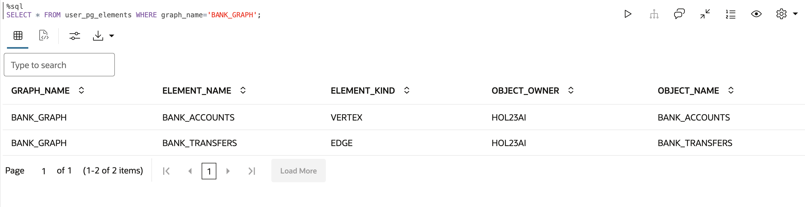
​
7. Get the properties associated with the labels.

    ```
    <copy>
    SELECT * FROM user_pg_label_properties WHERE graph_name='BANK_GRAPH';
    </copy>
    ```
​
    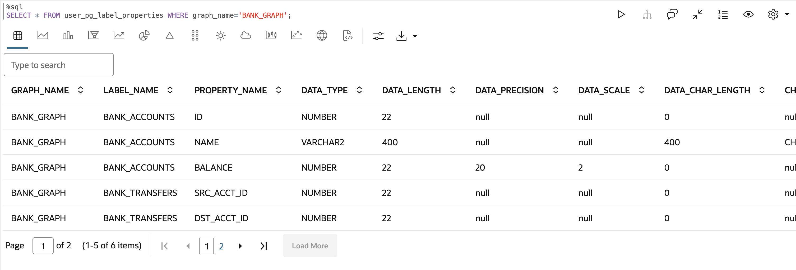
​
## Task 5 : Query bank_graph
​
In this task we will run queries using SQL/PGQ's GRAPH_TABLE operator, MATCH clause, and COLUMNS clause. The GRAPH\_TABLE operator enables you to query the property graph by specifying a graph pattern to look for and return the results as a set of columns. The MATCH clause lets you specify the graph patterns, and the COLUMN clause lists the query output columns. Everything else is existing SQL syntax.

A common query in analyzing money flows is to see if there is a sequence of transfers that connect one source account to a destination account. We'll be demonstrating that sequence of transfers in standard SQL.
​
1. Let's start by finding the top 10 accounts which have the most incoming transfers. 

    ```
    <copy>
    SELECT acct_id, COUNT(1) AS Num_Transfers 
    FROM graph_table ( BANK_GRAPH 
        MATCH (src) - [IS BANK_TRANSFERS] -> (dst) 
        COLUMNS ( dst.id AS acct_id )
    ) GROUP BY acct_id ORDER BY Num_Transfers DESC FETCH FIRST 10 ROWS ONLY;
    </copy>
    ```

    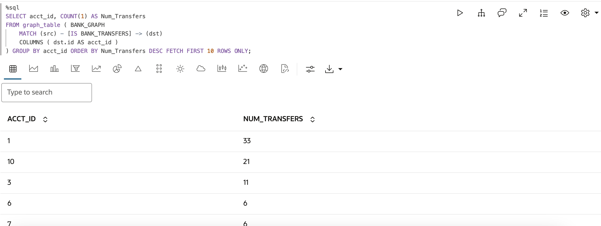
​
    We see that accounts **1** and **10** are high on the list. 

2.  What if we want to find the accounts where money was simply passing through. That is, let's find the top 10 accounts in the middle of a 2-hop chain of transfers.

    ```
    <copy>
    SELECT acct_id, COUNT(1) AS Num_In_Middle 
    FROM graph_table ( BANK_GRAPH 
        MATCH (src) - [IS BANK_TRANSFERS] -> (via) - [IS BANK_TRANSFERS] -> (dst) 
        COLUMNS ( via.id AS acct_id )
    ) GROUP BY acct_id ORDER BY Num_In_Middle DESC FETCH FIRST 10 ROWS ONLY;
    </copy>
    ```

    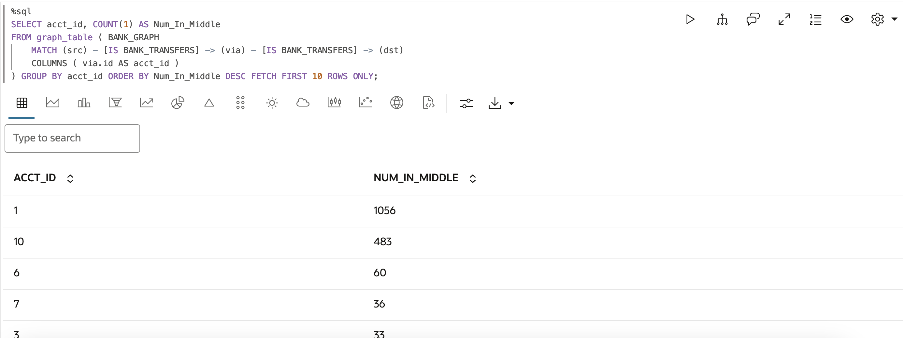
​
3. Note that account 1 shows up in both, so let's list accounts that received a transfer from account 1 in 1, 2, or 3 hops.

    ```
    <copy>
    SELECT account_id1, account_id2 
    FROM graph_table(BANK_GRAPH
        MATCH (v1)-[IS BANK_TRANSFERS]->{1,3}(v2) 
        WHERE v1.id = 1 
        COLUMNS (v1.id AS account_id1, v2.id AS account_id2)
    );
    </copy>
    ```

    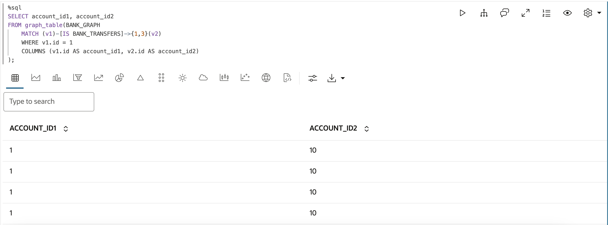

​
4. We looked at accounts with the most incoming transfers and those which were simply conduits. Now let's query the graph to determine if there are any circular payment chains, i.e. a sequence of transfers that start and end at the same account. First let's check if there are any 3-hop (triangles) transfers that start and end at the same account.

    ```
    <copy>
    SELECT acct_id, COUNT(1) AS Num_Triangles 
    FROM graph_table (BANK_GRAPH 
        MATCH (src) - []->{3} (src) 
        COLUMNS (src.id AS acct_id) 
    ) GROUP BY acct_id ORDER BY Num_Triangles DESC;
    </copy>
    ```

    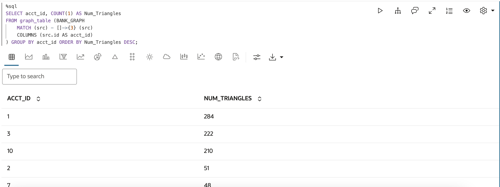
​
5. We can use the same query but modify the number of hops to check if there are any 4-hop transfers that start and end at the same account. 

    ```
    <copy>
    SELECT acct_id, COUNT(1) AS Num_4hop_Chains 
    FROM graph_table (BANK_GRAPH 
        MATCH (src) - []->{4} (src) 
        COLUMNS (src.id AS acct_id) 
    ) GROUP BY acct_id ORDER BY Num_4hop_Chains DESC;
    </copy>
    ```
​
    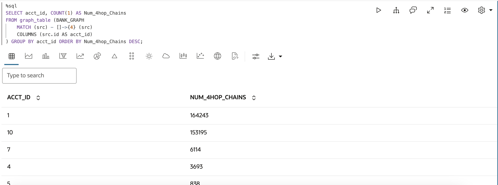
​
6. Lastly, check if there are any 5-hop transfers that start and end at the same account by just changing the number of hops to 5. 

    ```
    <copy>
   SELECT acct_id, COUNT(1) AS Num_5hop_Chains 
    FROM graph_table (BANK_GRAPH 
        MATCH (src) - []->{5} (src) 
        COLUMNS (src.id AS acct_id) 
    ) GROUP BY acct_id ORDER BY Num_5hop_Chains DESC;
    </copy>
    ```

    Note that though we are looking for longer chains we reuse the same MATCH pattern with a modified parameter for the desired number of hops. This compactness and expressiveness is a primary benefit of the new SQL/PGQ functionality.

    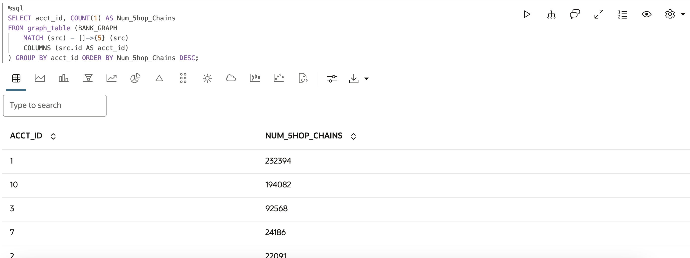

7.  Now that we know there are 3, 4, and 5-hop cycles, let's list some (any 10) accounts that had these circular payment chains. 

    ```
    <copy>
    SELECT DISTINCT(account_id) 
    FROM GRAPH_TABLE(BANK_GRAPH
       MATCH (v1)-[IS BANK_TRANSFERS]->{3,5}(v1)
        COLUMNS (v1.id AS account_id)  
    ) FETCH FIRST 10 ROWS ONLY;
    </copy>
    ```
​
    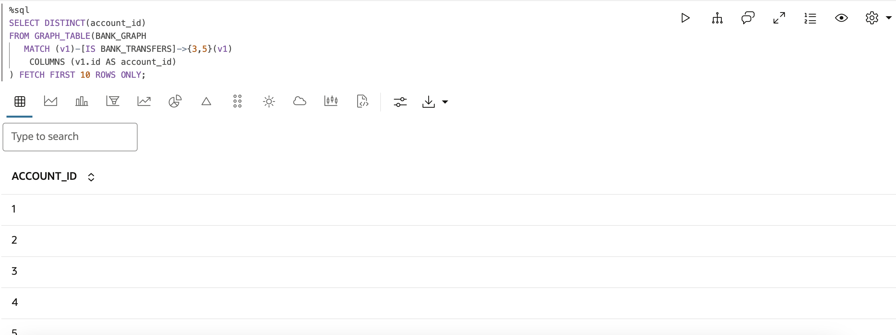
​
8.  Let's list the top 10 accounts by number of 3 to 5 hops that have circular payment chains in descending order. 

    ```
    <copy>
    SELECT DISTINCT(account_id), COUNT(1) AS Num_Cycles 
    FROM graph_table(BANK_GRAPH
        MATCH (v1)-[IS BANK_TRANSFERS]->{3, 5}(v1) 
        COLUMNS (v1.id AS account_id) 
    ) GROUP BY account_id ORDER BY Num_Cycles DESC FETCH FIRST 10 ROWS ONLY;
    </copy>
    ```
​
    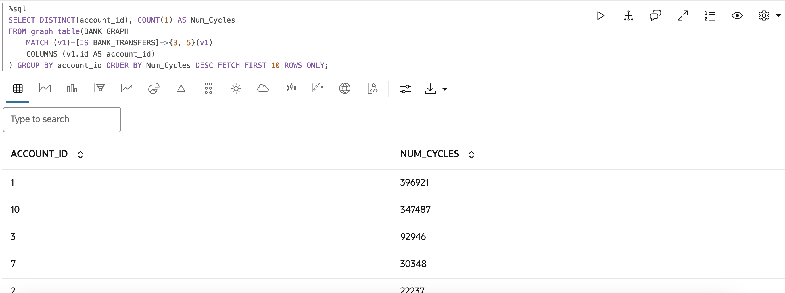
​
    Note that accounts **1**, **10** and **3** are the ones involved in most of the 3 to 5 hops circular payment chains. 
​
9. When we created the `BANK_GRAPH` property graph we essentially created a view on the underlying tables and metadata. No data is duplicated. So any insert, update, or delete on the underlying tables will also be reflected in the property graph.   

    Now, let's insert some more data into BANK\_TRANSFERS. We will see that when rows are inserted in to the BANK\_TRANSFERS table, the BANK\_GRAPH is updated with corresponding edges.

    ```
    <copy>
    INSERT INTO bank_transfers VALUES 
    (96, 19, 3, null, 1000),
    (97, 16, 3, null, 1000),
    (98, 20, 3, null, 1000),
    (99, 21, 3, null, 1000),
    (100, 18, 3, null, 1000),
    (101, 17, 3, null, 1000),
    (102, 15, 3, null, 1000),
    (103, 14, 3, null, 1000),
    (104, 13, 3, null, 1000),
    (105, 12, 3, null, 1000),
    (106, 11, 3, null, 1000),
    (107, 10, 3, null, 1000);
    </copy>
    ```

    Click the document icon to see the successful output.

    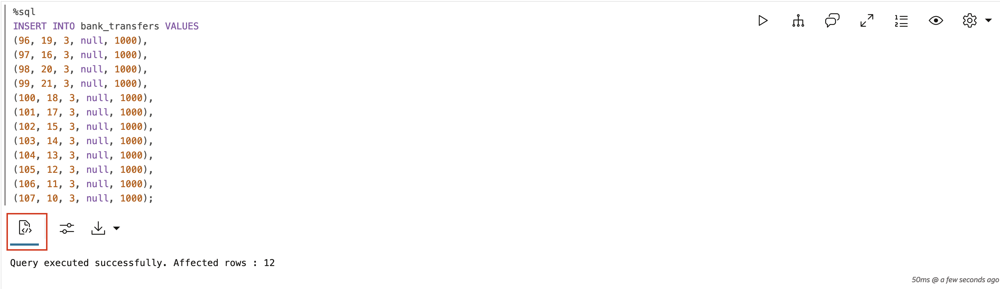

10. Re-run the top 10 query to see if there are any changes after inserting rows in BANK\_TRANSFERS.

    ```
    <copy>
    SELECT acct_id, count(1) AS Num_Transfers 
    FROM GRAPH_TABLE ( bank_graph 
    MATCH (src) - [is BANK_TRANSFERS] -> (dst) 
    COLUMNS ( dst.id as acct_id )
    ) GROUP BY acct_id ORDER BY Num_Transfers DESC fetch first 10 rows only;
    </copy>
    ```

    Notice how accounts **1**, and **3** are now ahead of **10**.

    Click back to the 3x3 square icon to look at the table output.

    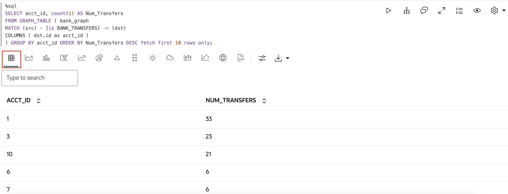
​
11. In Step 5 above we saw that accounts 1 and 3 had a number of 4-hop circular payments chains. Let's check if account 15 had any.

    ```
    <copy>
    SELECT count(1) Num_4Hop_Cycles 
    FROM graph_table(bank_graph 
    MATCH (s)-[]->{4}(s) 
    WHERE s.id = 15
    COLUMNS (1 as dummy) );
    </copy>
    ```

    It has 0.
​
   ​ 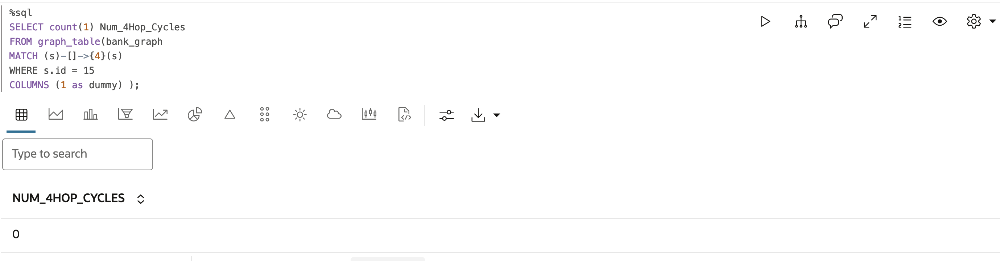
​
12.  So let’s insert more transfers which create some circular payment chains.

    We will be adding transfers from accounts **4**, **5**, and **6** into account **15**.

    ```
    <copy>
    INSERT INTO bank_transfers VALUES 
    (108, 4, 15, null, 1000),
    (109, 5, 15, null, 1000),
    (110, 6, 15, null, 1000);
    </copy>
    ```

    Click the document icon to see the successful output.

    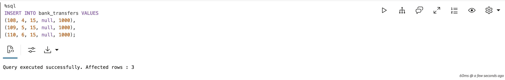
​
13.  Re-run the following query since we've added more circular payment chains.

    ```
    <copy>
    SELECT count(1) Num_4Hop_Cycles 
    FROM graph_table(bank_graph 
    MATCH (s)-[]->{4}(s) 
    WHERE s.id = 15
    COLUMNS (1 as dummy) );
    </copy>
    ```

    Click back to the 3x3 square icon to look at the table output.

    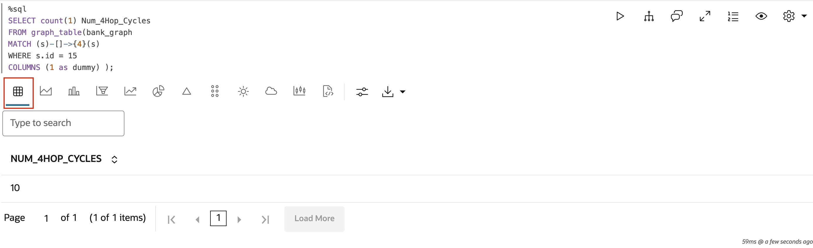

    Notice how we now have five 4-hop circular payment chains because the edges of BANK\_GRAPH were updated when additional transfers were added to BANK\_TRANSFERS. 

14.  We inserted three rows and that resulted in ten circular payment chains of length four. Let’s examine why.

    Execute the following query to find the number of 3-hop chains from account 15 to one of the accounts 4, 5, or 6.

    Note that there are 6 chains from account 15 to account 4 and another 2 from 15 to 5, and another 2 from 15 to 6.


    ```
    <copy>
    SELECT s0, a1, a2, a3 
    FROM graph_table(bank_graph 
    MATCH (s)-[]->(a)-[]->(b)-[]->(c)
    WHERE s.id = 15 and c.id in (4, 5, 6) 
    COLUMNS (s.id as s0, a.id as a1, b.id as a2, c.id as a3) );
    </copy>
    ```

    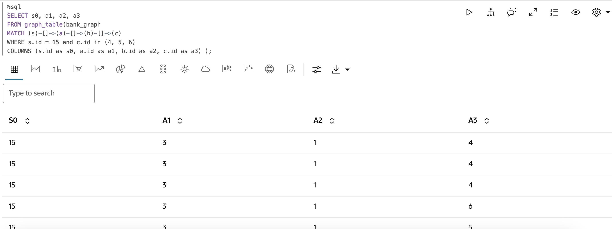

15. Load in memory the graph. Paste the following SQL statement into the text box:

    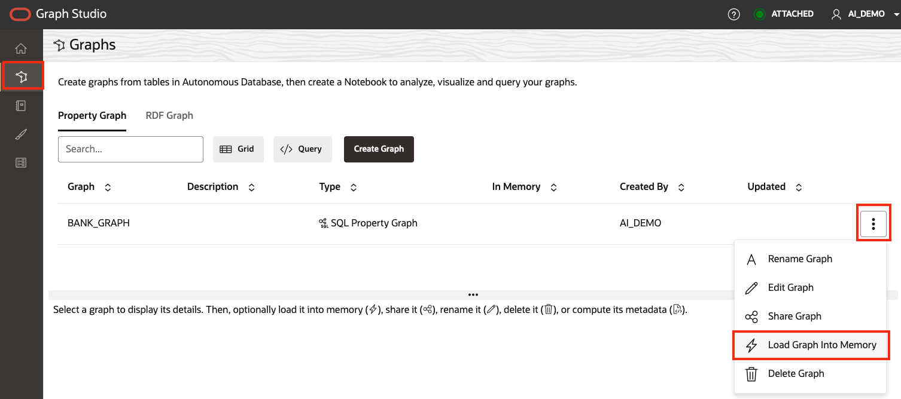
    
    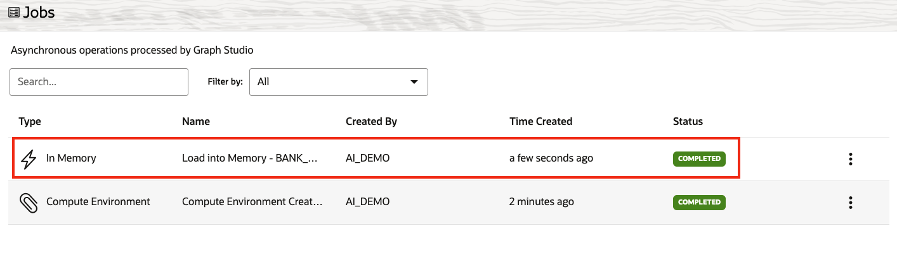

16. Into Bank Graph and load data into memory.

    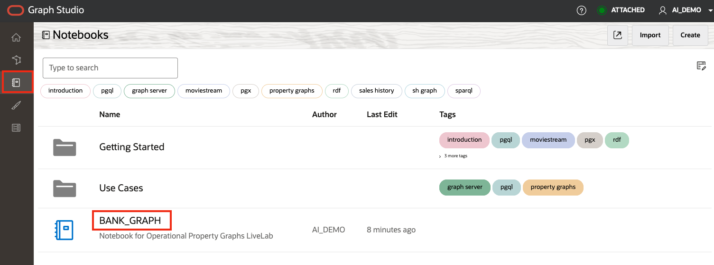

17. Load the data into memory.

    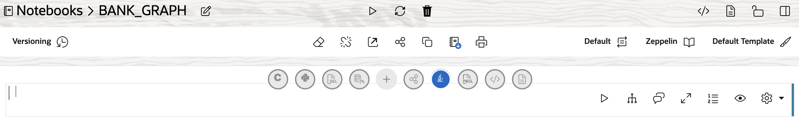

    ```
    <copy>
    var GRAPH_NAME="BANK_GRAPH";
    // try getting the graph from the in-memory graph server
    PgxGraph salesGraph = session.getGraph(GRAPH_NAME);
    // if it does not exist read it into memory
    if (salesGraph == null) {
        session.readGraphByName(GRAPH_NAME, GraphSource.PG_PGQL);
        out.println ("Graph "+ GRAPH_NAME + " successfully loaded");
        salesGraph = session.getGraph(GRAPH_NAME);
    } else {
       // out.println ("Graph "+ GRAPH_NAME + " already loaded");
       out.println ("Graph '"+ salesGraph.getName() + "' already loaded");
    }
    out.println ("# of Vertices: "+salesGraph.getNumVertices() + " \t" + "# of Edges: "+salesGraph.getNumEdges() +". In memory size is: " + salesGraph.getMemoryMb() + " Mb");
    </copy>
    ```
    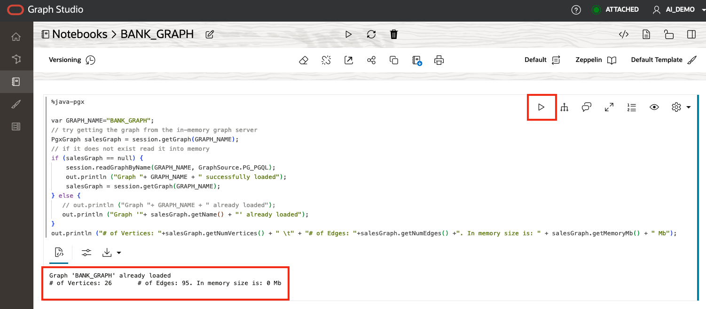

18. Review the first three account transfer data by graph view.

    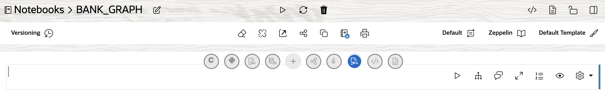

    ```
    <copy>
    SELECT *
    FROM graph_table(BANK_GRAPH
    MATCH (src) - [t is BANK_TRANSFERS] -> (dst) 
    COLUMNS (src.id AS source_acct, src.name AS source_acct_name, dst.id AS destination_acct, dst.name AS destination_acct_name, t.amount as amount)
    ) WHERE source_acct = 15
    </copy>
    ```

    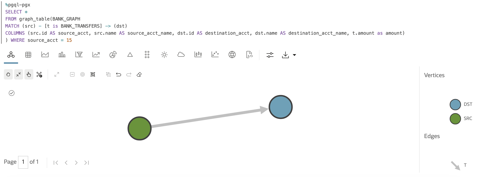

    ```
    <copy>
    SELECT *
    FROM graph_table(BANK_GRAPH
    MATCH (src) - [t is BANK_TRANSFERS] -> (dst) 
    COLUMNS (src.id AS source_acct, src.name AS source_acct_name, dst.id AS destination_acct, dst.name AS destination_acct_name, t.amount as amount)
    ) WHERE source_acct = 3
    </copy>
    ```

    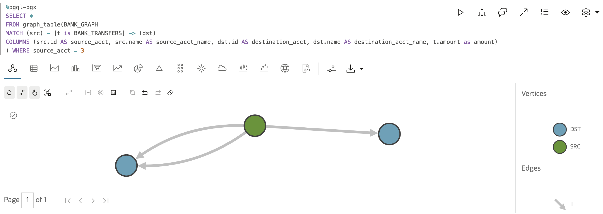

    ```
    <copy>
    SELECT *
    FROM graph_table(BANK_GRAPH
    MATCH (src) - [t is BANK_TRANSFERS] -> (dst) 
    COLUMNS (src.id AS source_acct, src.name AS source_acct_name, dst.id AS destination_acct, dst.name AS destination_acct_name, t.amount as amount)
    ) WHERE source_acct = 1
    </copy>
    ```

    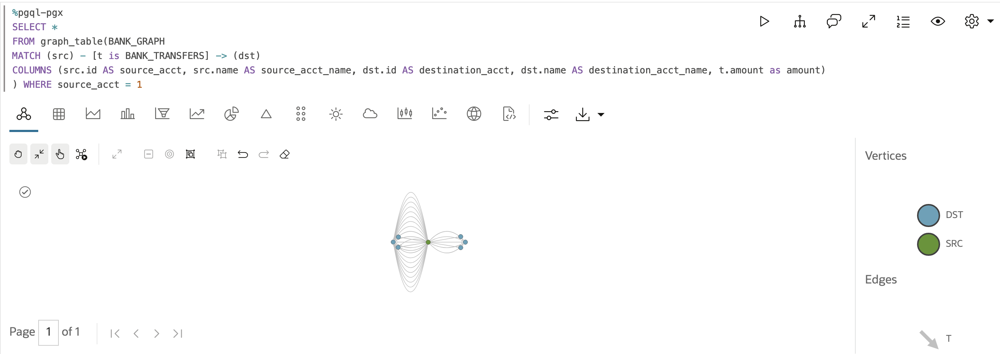

    ```
    <copy>
    SELECT *
    FROM graph_table(BANK_GRAPH
    MATCH (src) - [t is BANK_TRANSFERS] -> (dst) 
    COLUMNS (src.id AS source_acct, src.name AS source_acct_name, dst.id AS destination_acct, dst.name AS destination_acct_name, t.amount as amount)
    ) WHERE source_acct = 10
    </copy>
    ```

    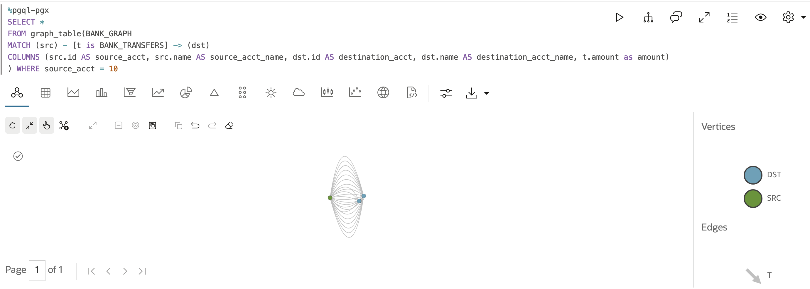

19. Finally let's undo the changes and delete the newly inserted rows.

    ```
    <copy>
    DELETE FROM bank_transfers 
    WHERE txn_id IN (96,97,98,99,100,101,102,103,104,105,106,107,108,109,110);
    </copy>
    ```
    ​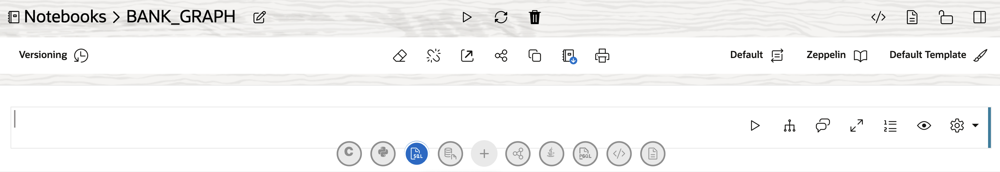
    ​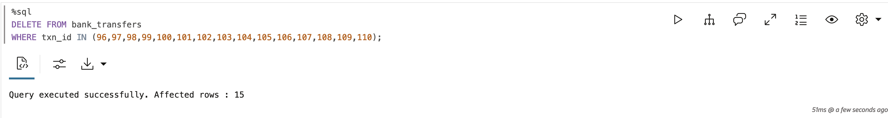

20. You have now completed this lab.

## Learn More

* [Introducing Oracle Database 23ai Free – Developer Release](https://blogs.oracle.com/database/post/oracle-database-23c-free)
