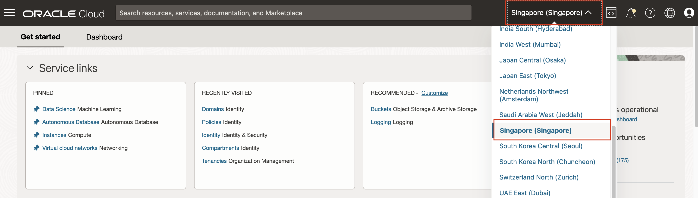
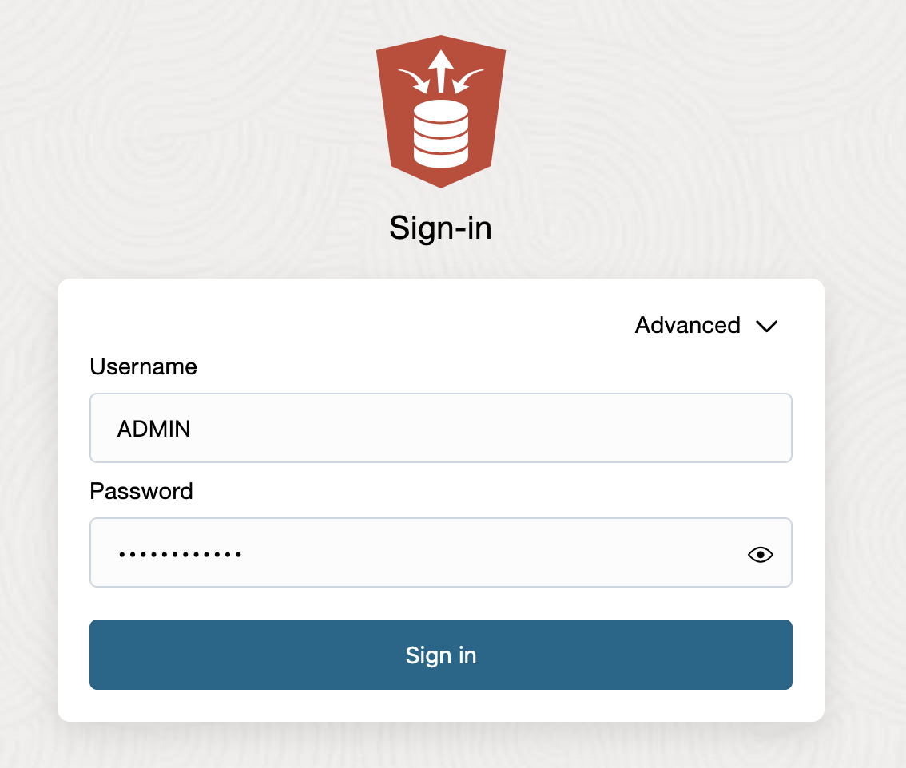
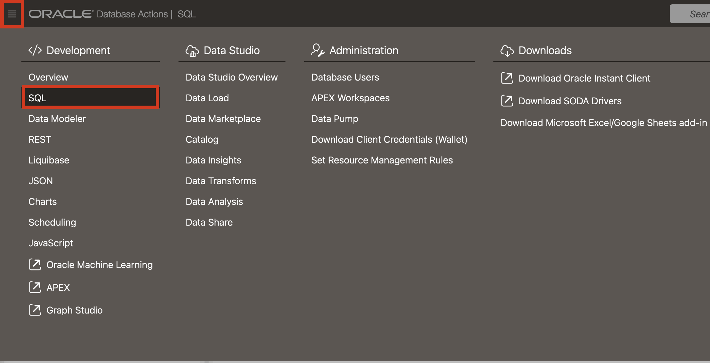

# Introduction

In this lab we will setup an Oracle Database. For this LiveLab, we will create an Always Free Oracle Autonomous Database 23ai (23ai always free ADB). All of the labs in this LiveLab and all of the features we are going to work with today are available and work on any 23ai database, regardless of the deployment style.

Estimated Lab Time: 10 minutes

### Objective:
The objective of this workshop is to set up the 23ai always free ADB. The following steps will guide you through the simple installation.

### Prerequisites:
- Complete the Get Started Lab.
- Basic understanding of SQL is helpful.

## Task 1: Database login
1. Log in to the Oracle Cloud Console and select the region Singapore.
   https://cloud.oracle.com/?region=ap-singapore-1&tenant=hutchhk

   Login account : **Workshop registration email address**

   Login Password : **AIWorkshop123#**

   After login, if the region is not Singapore, click the region name in the top right hand of the screen and select Singapore.

    

2. Using the hamburger menu in the top left hand of the screen, **click** Oracle Database and then click Autonomous Database.

    

3. Now select the **your name compartment**, and select **DEMODB** Autonomous Database.

    

4. Entry the SQL Action.

    

5. Sign into SQL Action.

    Username: ADMIN

    Password: Listed underneath Terraform Values -> User Password (AIWorkshop123#).

    

6. You've now login in Oracle Autonomous Database 23ai on Oracle Cloud Infrastructure. Explore any of the labs at your own pace.

    
    

## Learn More

* [Introducing Oracle Database 23ai](https://blogs.oracle.com/database/post/oracle-database-23ai-the-next-long-term-support-release)
* [Oracle Database Features and Licensing](https://apex.oracle.com/pls/apex/r/features/dbfeatures/home)

