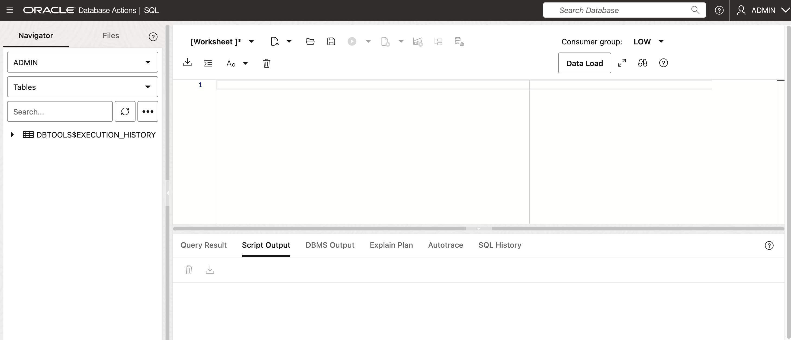

# Introduction

In this lab we will setup an Oracle Database. For this LiveLab, we will create an Always Free Oracle Autonomous Database 23ai (23ai always free ADB). All of the labs in this LiveLab and all of the features we are going to work with today are available and work on any 23ai database, regardless of the deployment style.

Estimated Lab Time: 10 minutes

### Objective:
The objective of this workshop is to set up the 23ai always free ADB. The following steps will guide you through the simple installation.

### Prerequisites:
- Complete the Get Started Lab.
- Basic understanding of SQL is helpful.

## Task 1: Database wallet download and login
1. Using the hamburger menu in the top left hand of the screen, **click** Oracle Database and then click Autonomous Database.

    

2. Now **select** "DEMODB" Autonomous Database.

    

3. Download the wallet and save it to your local machine. We will use this wallet to connect to the database later.

    
    

    Input the password "ComeWel123##". **Download** to download the wallet file.

    

    The wallet file will named **Wallet_################.zip**. (The ################. is the unique id of the database and will be different for each user.)

4. Entry the SQL development.

    

5. Sign-out admin user.

    

6. Input account "**AI_DEMO**", and password "ComeWel123##". **Click** Sign in to continue.

    

7. Entry the SQL development console.

    

8. You've now login in Oracle Autonomous Database 23ai on Oracle Cloud Infrastructure. Explore any of the labs at your own pace.

    

## Learn More

* [Introducing Oracle Database 23ai](https://blogs.oracle.com/database/post/oracle-database-23ai-the-next-long-term-support-release)
* [Oracle Database Features and Licensing](https://apex.oracle.com/pls/apex/r/features/dbfeatures/home)

## Acknowledgements
* **Author** - Killian Lynch, Database Product Management
* **Contributors** - Dom Giles, Distinguished Database Product Manager
* **Last Updated By/Date** - Killian Lynch, April 2024
