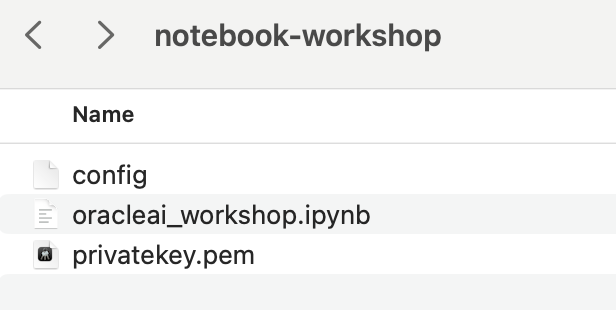
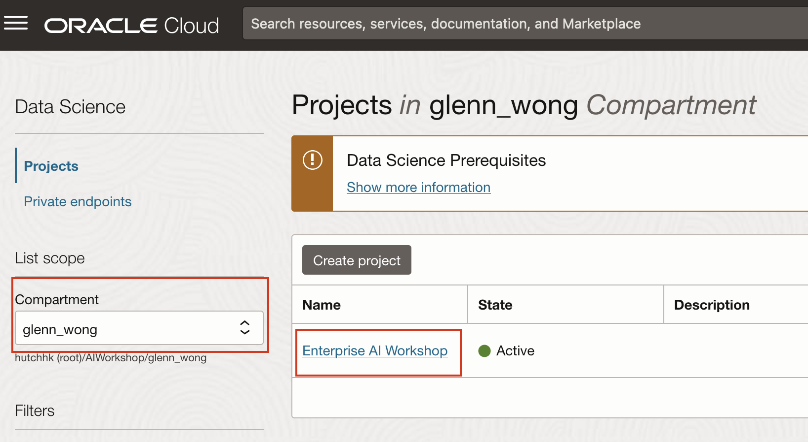
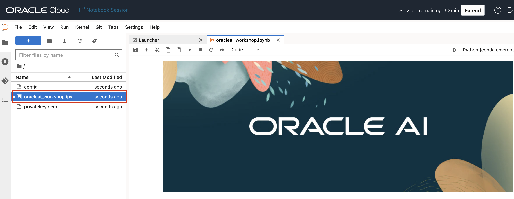

# Oracle Cloud Infrastructure GenAI Service and Oracle 23ai

## Introduction

- How Oracle Gen AI service and Oracle 23ai can be used within LangChain framework
- How to leverage Oracle 23ai's AI Vector Search and Graph to perform Advanced RAG
- How to use Oracle GenAI service to create an chat that answers questions intelligently using private information stored in Oracle 23ai 
- Look at the multi-lingual capability of Oracle GenAI Service

**We are also going to use an AI Agent in the lab:**
- Langchain Agent Framework
- Structed Chat ReAct Agent
- Agent Tools

**_Estimated Lab Time: 30 minutes_**

## Task 1: Login the Data Science environment
1. Click [this link] (https://objectstorage.ap-singapore-1.oraclecloud.com/n/hutchhk/b/AIWorkshop/o/notebook-workshop.zip) to download the zip file with our notebook setup materials.

2. Unzip the files. You should see these files available.

    

3. Navigate to Data Science.

    

4. Into the Data Science Project.

    

5. Into the Data Science Session.
    

6. Into the Notebook Lab.
    

7. Continue to sign-in.
    

8. Sign-in success.
    

## Task 2. Import the Data science notebook

1. In Into the Data Science Notebook Lab. You can extend the session first. Then upload this file that we downloaded and unzip.

    

    Select the file and upload.
    

    You can see the uploaded file in console.
    

3. Entry the notebook and start ot run the notebook.
    

6. Let's start to run the notebook.

## Task 3: Integrate JSON, Graph, GenAI and 23ai Vector Search

After you have opened the notebook, you can press the **Shift+Enter** to execute the notebook script step by step.  

In this notebook, we are are going to show you:

- How Oracle Gen AI service and Oracle 23ai can be used within LangChain framework
- How to leverage Oracle 23ai's AI Vector Search and Graph to perform Advanced RAG
- How to use Oracle GenAI service to create an chat that answers questions intelligently using private information stored in Oracle 23ai 
- Look at the multi-lingual capability of Oracle GenAI Service

We are also going to use an AI Agent in the lab:  
- Langchain Agent Framework
- Structed Chat ReAct Agent
- Agent Tools

### The notebook has 2 main sections
* Oracle 23ai Vector Search with Document Processing
* Oracle Cloud Infrastructure Gen AI Service
### Now, let's switch to the notebook for further instructions and have some fun!

## Learn More

* [AI Vector Search User Guide](https://docs.oracle.com/en/database/oracle/oracle-database/23/vecse/oracle-ai-vector-search-users-guide.pdf)
* [23ai Release notes](https://docs.oracle.com/en/database/oracle/oracle-database/23/rnrdm/index.html)
* [7 Easy Steps to Building a RAG Application using LangChain](https://livelabs.oracle.com/pls/apex/r/dbpm/livelabs/view-workshop?wid=3927&clear=RR,180&session=1859311324732)
* [Build an AI Chatbot engine with Oracle Database 23ai and OCI Generative AI Services](https://livelabs.oracle.com/pls/apex/r/dbpm/livelabs/view-workshop?wid=3939&clear=RR,180&session=107280580579860)
* [Using Vector Embedding Models with Python](https://livelabs.oracle.com/pls/apex/r/dbpm/livelabs/view-workshop?wid=3928&clear=RR,180&session=1859311324732)
* [Using Vector Embedding Models with Nodejs](https://livelabs.oracle.com/pls/apex/r/dbpm/livelabs/view-workshop?wid=3926&clear=RR,180&session=1859311324732)

## Acknowledgements
* **Author** - Killian Lynch, Database Product Management
* **Contributors** - Dom Giles, Distinguished Database Product Manager
* **Last Updated By/Date** - Killian Lynch, April 2024