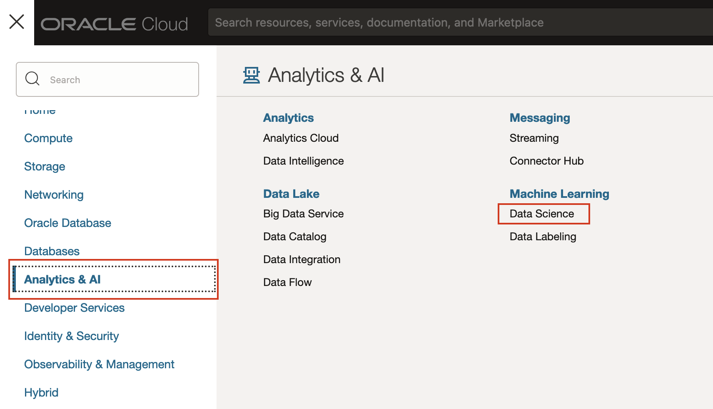
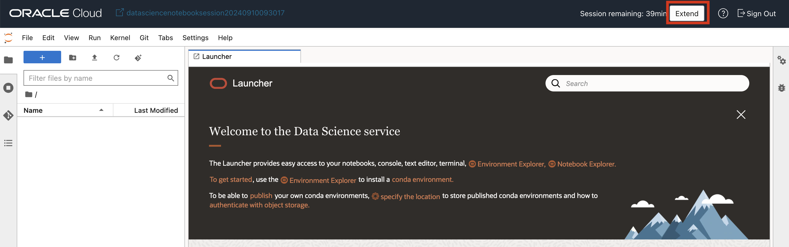
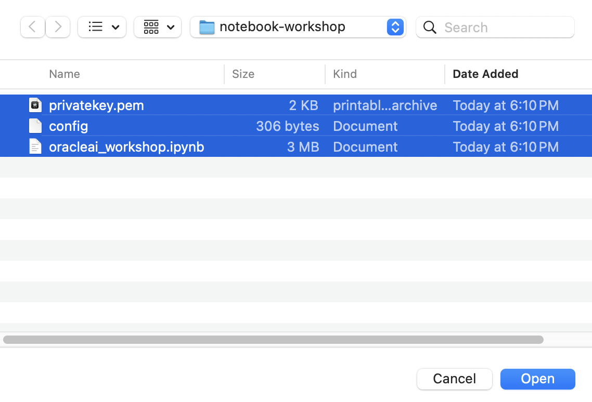
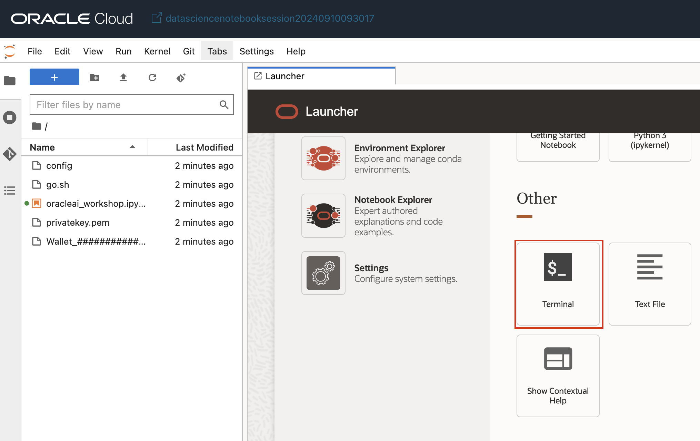

# Exploring AI Vector Search

## Introduction

Welcome to the "Exploring AI Vector Search" workshop. In this workshop, you will learn what vectors are and how they are used in AI applications. We will cover the creation of vector tables, perform basic DDL operations, and dive into similarity search using some of the new SQL functions in Oracle Database 23ai. This lab is meant to be a small introduction to the new AI functionality that Oracle Database 23ai supports.

This lab will focus on AI Vector search at a very high level. If you're looking for an in depth workshop on AI Vector Search, check out the following labs:
* [Complete RAG Application using PL/SQL in Oracle Database 23ai](https://livelabs.oracle.com/pls/apex/r/dbpm/livelabs/view-workshop?wid=3934&clear=RR,180&session=1859311324732)
* [7 Easy Steps to Building a RAG Application using LangChain](https://livelabs.oracle.com/pls/apex/r/dbpm/livelabs/view-workshop?wid=3927&clear=RR,180&session=1859311324732)
* [Using Vector Embedding Models with Python](https://livelabs.oracle.com/pls/apex/r/dbpm/livelabs/view-workshop?wid=3928&clear=RR,180&session=1859311324732)
* [Using Vector Embedding Models with Nodejs](https://livelabs.oracle.com/pls/apex/r/dbpm/livelabs/view-workshop?wid=3926&clear=RR,180&session=1859311324732)

Estimated Lab Time: 20 minutes

### Objective:
In this lab, you will explore the new vector data type introduced in Oracle Database 23ai. You will create a vector table and perform basic DDL operations on the vectors. You will also learn about similarity search and how it relates to vectors, as well as use some of the new AI focused SQL functions in the database.

### Prerequisites:
- Access to Oracle Database 23ai environment.
- Basic understanding of SQL and PL/SQL.

## Task 1: Login the Data Science environment
1. Click [this link] (https://objectstorage.ap-singapore-1.oraclecloud.com/n/hutchhk/b/AIWorkshop/o/notebook-workshop.zip) to download the zip file with our notebook setup materials.

2. Unzip the files. You should see these files available. In the same time, copy the previous database setup section downloaded **Wallet_################.zip** file into the folder too. This file will be upload to the data science project later.

    

3. Navigate to Data Science.

    

4. Into the Data Science Project.

    

5. Into the Data Science Session.
    

6. Into the Notebook Lab.
    

7. Continue to sign-in.
    

8. Sign-in success.
    

## Task 2. Import the Data science notebook

1. Into the Data Science Notebook Lab. You can extend the session first. Then upload this file that we downloaded and unzip.

    

    Select the file and upload.
    

    You can see the uploaded file in console.
    

2. Into the Terminal.
    

3. In the Terminal, type in "sh go.sh" and press "Enter" to execute the shell file.
    

4. Complete the configuration setup.
    

5. Entry the notebook and start ot run the notebook.
    

6. Let's start to run the notebook.

## Task 3: Integrate the JSON, Graph, and Vector AI

1. Let's start to run the notebook. You can press the **Shift+Enter** to execute the notebook script step by step.
    
    Install require python libraries.
    
    
    Connect to the database successfully.
    
    Load Document.
    

    
    
    
    
    
    
    
    
    
    

## Learn More

* [AI Vector Search User Guide](https://docs.oracle.com/en/database/oracle/oracle-database/23/vecse/oracle-ai-vector-search-users-guide.pdf)
* [23ai Release notes](https://docs.oracle.com/en/database/oracle/oracle-database/23/rnrdm/index.html)
* [7 Easy Steps to Building a RAG Application using LangChain](https://livelabs.oracle.com/pls/apex/r/dbpm/livelabs/view-workshop?wid=3927&clear=RR,180&session=1859311324732)
* [Using Vector Embedding Models with Python](https://livelabs.oracle.com/pls/apex/r/dbpm/livelabs/view-workshop?wid=3928&clear=RR,180&session=1859311324732)
* [Using Vector Embedding Models with Nodejs](https://livelabs.oracle.com/pls/apex/r/dbpm/livelabs/view-workshop?wid=3926&clear=RR,180&session=1859311324732)

## Acknowledgements
* **Author** - Killian Lynch, Database Product Management
* **Contributors** - Dom Giles, Distinguished Database Product Manager
* **Last Updated By/Date** - Killian Lynch, April 2024