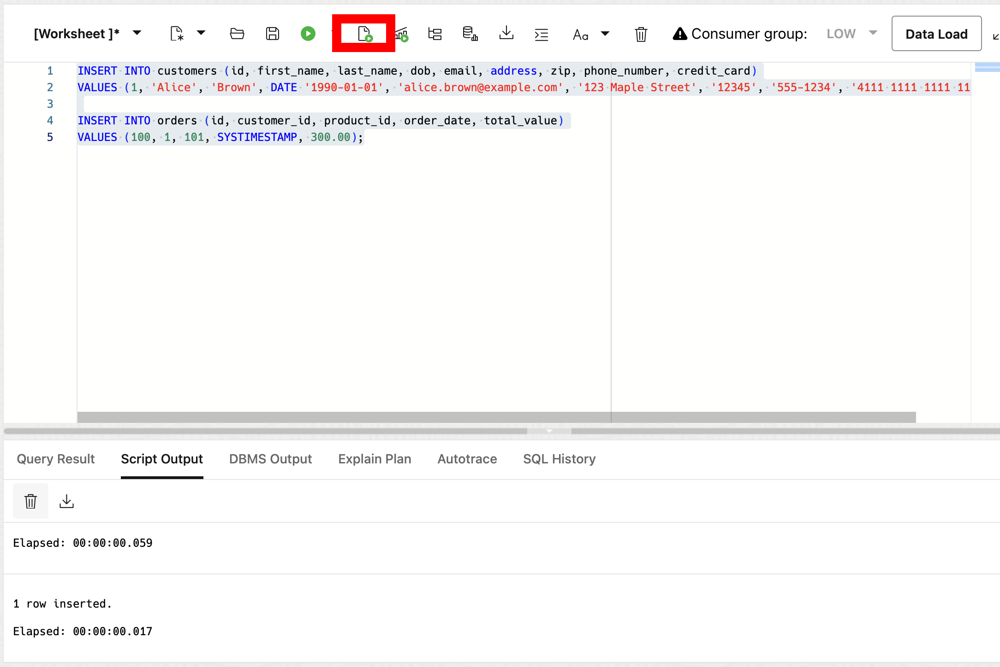
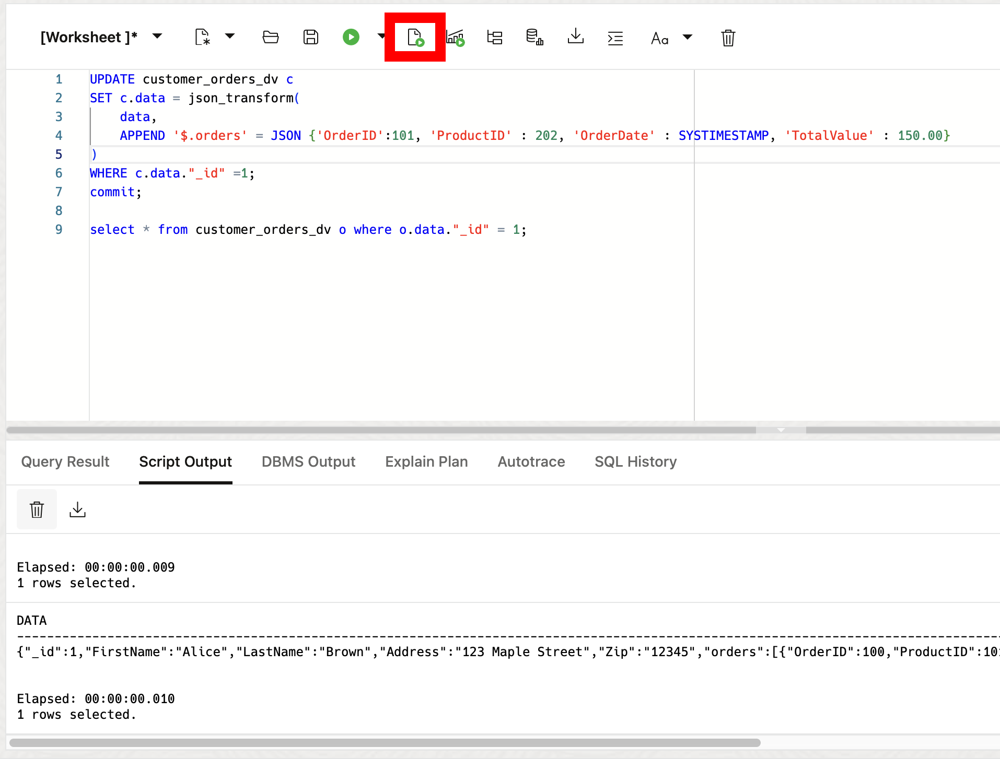
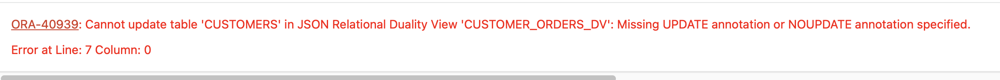

# Exploring JSON Relational Duality with SQL

## Introduction

Welcome to the "Exploring JSON Relational Duality with SQL" lab. In this lab, you will learn about the JSON Relational Duality feature, which allows for the seamless integration between the relational and JSON data models. This feature provides the strengths of both approaches, allowing you to easily manipulate data in either model.

This lab is only intended to give you a small taste of what Duality Views have to offer. For full, in-depth free workshops, follow this [link](https://livelabs.oracle.com/pls/apex/f?p=133:100:110578183178299::::SEARCH:duality%20views).

**_Estimated Lab Time: 15 minutes_**

### **Objectives**

This lab aims to provide hands-on experience with JSON-relational Duality Views, demonstrating how to get the strengths of both JSON and relational data models. You will learn how to create, query, and update JSON-relational Duality Views using SQL.

### **Prerequisites**

This lab assumes you have:

* Oracle Database 23ai
* Completed the Get Started Lab

## Task 1: Create Relational Tables

1. Create the 'bank_accounts' and 'bank_transfers' relational tables. The following code block creates two tables for account and transfer data. Copy and run the following SQL script:
    ```
    <copy>
    DROP PROPERTY GRAPH BANK_GRAPH;

    DROP TABLE if exists bank_transfers CASCADE CONSTRAINTS;
    DROP TABLE if exists bank_accounts CASCADE CONSTRAINTS;
    DROP VIEW if exists bank_accounts_dv CASCADE CONSTRAINTS;
    DROP VIEW if exists bank_transfers_dv CASCADE CONSTRAINTS;

    DROP TABLE if exists SDW$ERR$_BANK_ACCOUNTS CASCADE CONSTRAINTS;
    DROP TABLE if exists SDW$ERR$_BANK_TRANSFERS CASCADE CONSTRAINTS;

    -- Create a table to store bank_accounts data
    CREATE TABLE if not exists BANK_ACCOUNTS (
        id             NUMBER,
        name           VARCHAR2(100),
        balance        NUMBER,
        email          VARCHAR2(100),
        address        VARCHAR2(200),
        zip            VARCHAR2(10),
        phone_number   VARCHAR2(20)
    );

    -- Create a table to store bank_transfers data
    CREATE TABLE if not exists BANK_TRANSFERS (
        txn_id          NUMBER,
        src_acct_id     NUMBER,
        dst_acct_id     NUMBER,
        description     VARCHAR(400),
        amount          NUMBER
    );

    -- Add constraints
    ALTER TABLE BANK_ACCOUNTS ADD PRIMARY KEY (id);
    ALTER TABLE BANK_TRANSFERS ADD PRIMARY KEY (TXN_ID);
    ALTER TABLE BANK_TRANSFERS MODIFY SRC_ACCT_ID REFERENCES BANK_ACCOUNTS (ID);

    -- Optionally verify constraints
    SELECT * FROM USER_CONS_COLUMNS WHERE table_name IN ('BANK_ACCOUNTS', 'BANK_TRANSFERS');

    </copy>
    ```

## Task 2: Create JSON Relational Duality Views

1. Create a duality view of the bank_accounts table. We'll use this one to manage our account information.

    Using Duality Views, you can define how the data is accessed and used. Duality Views allow you to specify @insert, @update, and @delete privileges, meaning you define exactly how the applications and/or the developers work with data.

    ```
    <copy>
    CREATE OR REPLACE JSON RELATIONAL DUALITY VIEW bank_accounts_dv AS
    bank_accounts @insert @update @delete
    {
        _id             : id,
        name            : name,
        balance         : balance,
        email           : email,
        address         : address,
        zip             : zip,
        phoneNumber     : phone_number
    }
;
	</copy>
    ```

2. Say we want to exclude sensitive personally identifiable information like bank_accounts phone numbers. Let's create another view without those identifiers.

    ```
    <copy>
    CREATE OR REPLACE JSON RELATIONAL DUALITY VIEW bank_transfers_dv AS
        bank_accounts
        {
            _id             : id,
            name            : name,
            address         : address,
            zip             : zip,
            bank_transfers : bank_transfers @insert @update @delete
            [
                {
                    txnid         : txn_id,
                    dstAcctId     : dst_acct_id,
                    description   : description,
                    amount        : amount
                }
            ]
        };
	</copy>
    ```

    If you notice, this view doesn’t specify @insert, @update, or @delete on our bank_accounts table. You created this view so that you can only update orders through the `bank_transfers_dv` Duality View, and no sensitive bank_accounts information (such as bank_accounts’ credit card numbers or phone numbers) will be shown. The only way to manage that information is through the `bank_accounts_dv` view.

	

## Task 3: Add Data

1. Now that the duality view has been created, we can insert data to the relational table or into the duality view. Let's start with adding data directly to the relational tables.


	```
	<copy>
    INSERT INTO bank_accounts (id, name, balance, email, address, zip, phone_number)
    VALUES (23, 'W company', 60655.89, 'w.company@example.com', '145 Maple Street', '12345', '555-1256');
    INSERT INTO bank_accounts (id, name, balance, email, address, zip, phone_number)
    VALUES (24, 'X company', 111288.55, 'x.company@example.com', '146 Maple Street', '12345', '555-1257');
    INSERT INTO bank_accounts (id, name, balance, email, address, zip, phone_number)
    VALUES (25, 'Y company', 142310.63, 'y.company@example.com', '147 Maple Street', '12345', '555-1258');


    INSERT INTO bank_transfers (txn_id, src_acct_id, dst_acct_id, description, amount)
    VALUES (1, 24, 25, 'transfer', 4050);

	</copy>
    ```
    

2. Let's now insert data into the duality view of our account data.

	```
	<copy>
    INSERT INTO bank_accounts_dv values ('{"_id":26,"name":"Z company","email":"z.company@example.com","address":"148 Maple Street","zip":"12345","phoneNumber":"555-1259"}');

    commit;
	</copy>
    ```

3. Let's see how the duality views have changed.

    This Duality View will show us two accounts.

	```
	<copy>
    SELECT json_serialize(DATA PRETTY) FROM bank_accounts_dv;
	</copy>
    ```
    This Duality View will show us the same two accounts - one with an order and one without.

	```
	<copy>
    SELECT json_serialize(DATA PRETTY) FROM bank_transfers_dv t WHERE t.data."_id" = 24;
	</copy>
    ```
4. Let's see how the relational tables have changed.

	```
	<copy>
    select * from bank_accounts;
	</copy>
    ```

## Task 4: Update Data

1. Remember, the `bank_transfers_dv` duality view only allows us to modify the order data. Let's update Alice's transfers.

	```
	<copy>
    UPDATE bank_transfers_dv t
    SET t.data = json_transform(
        data,
        APPEND '$.bank_transfers' = JSON {'txnid':2, 'dstAcctId' : 26, 'description' : 'transfer', 'amount' : 1186.00}
    )
    WHERE t.data."_id" = 24;
    commit;

    select json_serialize(data PRETTY) from bank_transfers_dv t where t.data."_id" = 24;
    </copy>
    ```

    

2. Let's now try and update Alice's last name. You'll see that this is not allowed!

	```
	<copy>
    UPDATE bank_transfers_dv t
    SET t.data = json_transform(
        data,
        SET '$.name' = 'ABC company'
    )
    WHERE t.data."_id" =23;

    </copy>
    ```
    

3. Let's insert some orders for our account Jim Brown using `mergepatch`.

	```
	<copy>
    update bank_transfers_dv t set data = json_mergepatch(data,'{"bank_transfers" :
    [
        {
            "txnid": 3,
            "dstAcctId": 23,
            "description": "transfer",
            "amount": 4450
        }
    ]}')
    where t.data."_id" = 25;

    update bank_transfers_dv t set data = json_mergepatch(data,'{"bank_transfers" :
    [
        {
            "txnid": 4,
            "dstAcctId": 24,
            "description": "transfer",
            "amount": 1186
        }
    ]}')
    where t.data."_id" = 26;

    commit;
    </copy>
    ```

4. Imagine we needed to change one of the transfer destination account IDs, for example dst_acct_id = 200 shown below. 

    ```
    <copy>
    SELECT json_serialize(data PRETTY) FROM bank_transfers_dv;
    </copy>
    ```

5. Using a single update statement, we can easily update product_id 202 to 999 in every JSON duality view.

	```
	<copy>
    UPDATE bank_transfers
    SET dst_acct_id = 23
    WHERE txn_id = 4;

    commit;

    SELECT json_serialize(data PRETTY) FROM bank_transfers_dv WHERE json_value(DATA, '$._id') = 26;
    </copy>
    ```

    You can now see that the update made to the orders table has propogated to the account transfer duality view, and the same occurs for all other representations of the accounts table!


6. Review the all transfer record by SQL Query table.

	```
	<copy>
    SELECT * from bank_transfers order by TXN_ID;
    </copy>
    ```


**You've completed the workshop!**

Note that the "etag" value supplied in the content is used for "out-of-the-box" optimistic locking to prevent the well-known "lost update" problem that can occur with concurrent operations. During a replace operation, the database checks that the eTag provided in the replacement document matches the latest eTag of the target Duality View document.

If the eTags do not match, which can occur if another concurrent operation updated the same document, an error is thrown. If you get the error, you can reread the updated value (including the updated eTag), and retry the replace operation again, adjusting it (if desired) based on the updated value.


## Learn More

* [JSON Relational Duality: The Revolutionary Convergence of Document, Object, and Relational Models](https://blogs.oracle.com/database/post/json-relational-duality-app-dev)
* [JSON Duality View documentation](https://docs.oracle.com/en/database/oracle/oracle-database/23/jsnvu/overview-json-relational-duality-views.html#)

## Acknowledgements
* **Author** - Killian Lynch, Oracle Database Product Management, Product Manager
* **Contributors** - Dominic Giles, Oracle Database Product Management, Distinguished Product Manager
* **Last Updated By/Date** - Briana Ambler, Oracle Database Product Management, Product Manager, August 2024
